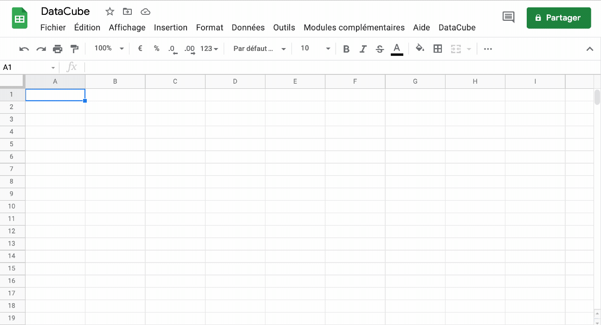

# DataCube

Access easily your data and take advantage of Google BigQuery directly from your Google Spreadsheet.
## Usage



/!\ This library use the native Google & BigQuery API behind. Be sure to verify the quota and do not forget querying BigQuery has a cost.

## Development

### Getting started

Enable [API Google Apps Script](https://script.google.com/home/usersettings) on your Google account.

```
yarn clasp login
yarn clasp create --type sheets --title DataCube
yarn clasp open
```

Setup https for local development & react hot-reload.

```
brew install mkcert
mkcert -install
mkdir -p certs
mkcert -key-file ./certs/key.pem -cert-file ./certs/cert.pem localhost 127.0.0.1
```

It should be ready to access on your newly created sheet (you may need to reload the sheet) and the BigQuery button should appear on the top bar.

```
yarn start
yarn lint
```

On client code change, the dev iframe should reload itself in the sheet whereas on the server side a manual repush is needed.

### Deploy

```
yarn clasp setting rootDir dist
npm run deploy
```

##

Based on https://github.com/enuchi/React-Google-Apps-Script.
